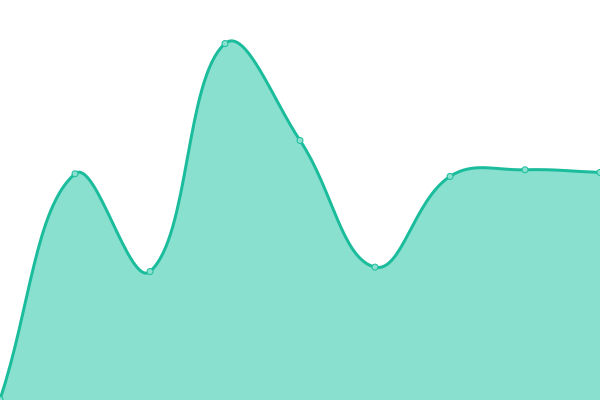
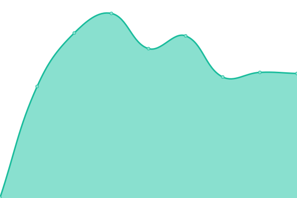
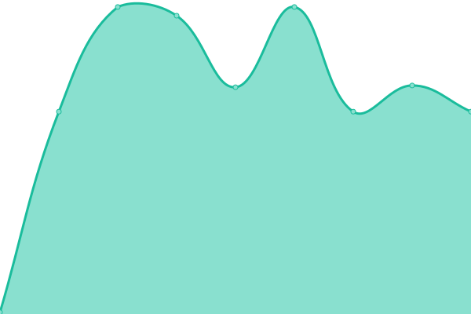
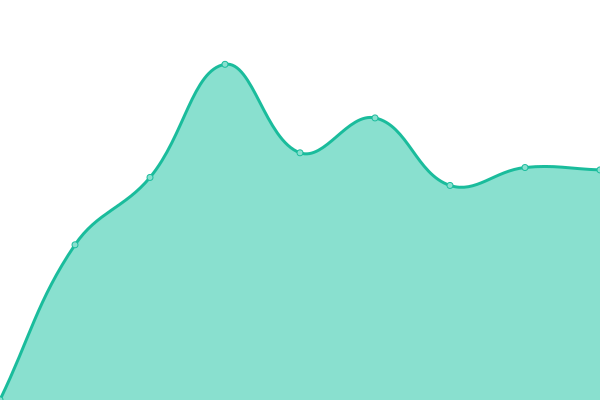
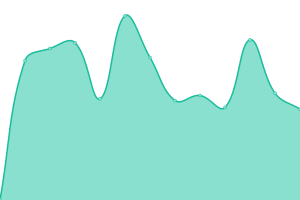

# [📈 Live Status](https://status.o3o.foundation): <!--live status--> **🟧 Partial outage**

This repository contains the open-source uptime monitor and status page for [O3O.Foundation](https://o3o.foundation/), powered by [Upptime](https://github.com/upptime/upptime).

With [Upptime](https://upptime.js.org), you can get your own unlimited and free uptime monitor and status page, powered entirely by a GitHub repository. We use [Issues](https://github.com/o3o-ca/o3o-uptime/issues) as incident reports, [Actions](https://github.com/o3o-ca/o3o-uptime/actions) as uptime monitors, and [Pages](https://status.o3o.foundation) for the status page.

<!--start: status pages-->
<!-- This summary is generated by Upptime (https://github.com/upptime/upptime) -->
<!-- Do not edit this manually, your changes will be overwritten -->
<!-- prettier-ignore -->
| URL | Status | History | Response Time | Uptime |
| --- | ------ | ------- | ------------- | ------ |
|  [O3O.ca (Mastodon)](https://o3o.ca) | 🟩 Up | [o3-o-ca-mastodon.yml](https://github.com/o3o-ca/o3o-uptime/commits/HEAD/history/o3-o-ca-mastodon.yml) | 

 594ms
     
 | 

<a href="https://status.o3o.foundation/history/o3-o-ca-mastodon">100.00%</a>
    

|  [Mastodon.im (Mastodon)](https://mastodon.im) | 🟩 Up | [mastodon-im-mastodon.yml](https://github.com/o3o-ca/o3o-uptime/commits/HEAD/history/mastodon-im-mastodon.yml) | 

 647ms
     
 | 

<a href="https://status.o3o.foundation/history/mastodon-im-mastodon">100.00%</a>
    

|  [Writee (Writefreely)](https://writee.org) | 🟩 Up | [writee-writefreely.yml](https://github.com/o3o-ca/o3o-uptime/commits/HEAD/history/writee-writefreely.yml) | 

 624ms
     
 | 

<a href="https://status.o3o.foundation/history/writee-writefreely">100.00%</a>
    

|  [O3O Cafe (Matrix)](matrix.o3o.cafe) | 🟩 Up | [o3-o-cafe-matrix.yml](https://github.com/o3o-ca/o3o-uptime/commits/HEAD/history/o3-o-cafe-matrix.yml) | 

 184ms
     
 | 

<a href="https://status.o3o.foundation/history/o3-o-cafe-matrix">100.00%</a>
    

|  [Blog.edu.kg (WordPress)](https://blog.edu.kg) | 🟩 Up | [blog-edu-kg-word-press.yml](https://github.com/o3o-ca/o3o-uptime/commits/HEAD/history/blog-edu-kg-word-press.yml) | 

 1726ms
     
 | 

<a href="https://status.o3o.foundation/history/blog-edu-kg-word-press">99.29%</a>
    

|  [o3o.foundation](https://o3o.foundation) | 🟥 Down | [o3o-foundation.yml](https://github.com/o3o-ca/o3o-uptime/commits/HEAD/history/o3o-foundation.yml) | 

 1601ms
     
 | 

<a href="https://status.o3o.foundation/history/o3o-foundation">99.45%</a>
    

<!--end: status pages-->

[**Visit our status website →**](https://status.o3o.foundation)

## 📄 License

- Powered by: [Upptime](https://github.com/upptime/upptime)
- Code: [MIT](./LICENSE) © [Anand Chowdhary](https://anandchowdhary.com), supported by [Pabio](https://pabio.com)
- Data in the `./history` directory: [Open Database License](https://opendatacommons.org/licenses/odbl/1-0/)
